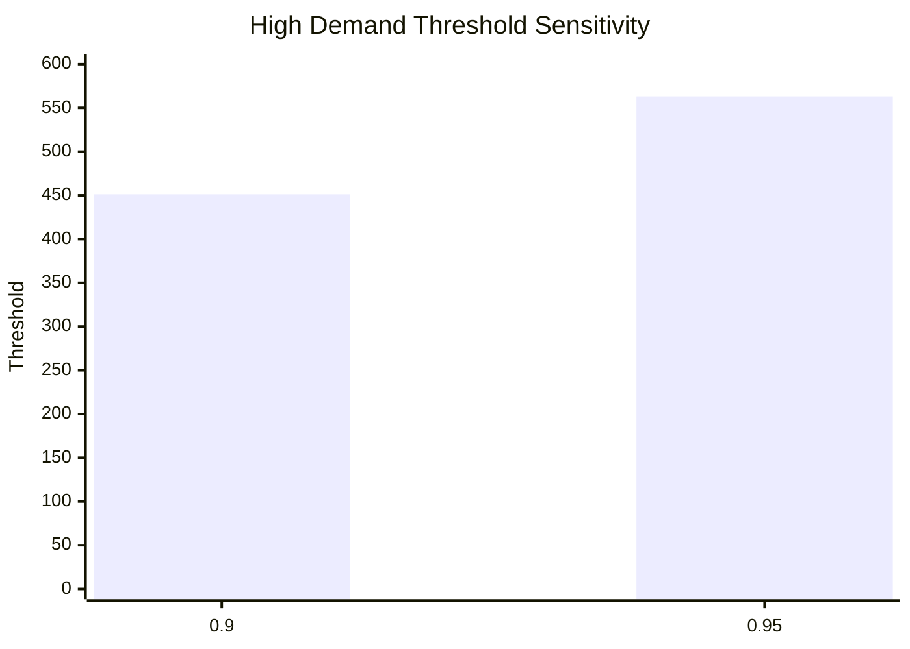

# MLflow Experiment Analytics

## 📊 Run Comparison
This table summarizes the tracked experiments in the `bike-sharing-baseline` experiment.

| run_id                           |   Quantile |   Threshold |   Rows Processed | Local Path                                      |
|:---------------------------------|-----------:|------------:|-----------------:|:------------------------------------------------|
| 3af3657571e04f76ab937d4887d5e1df |       0.95 |       563.1 |            17379 | runs/2026-04-22_16-36-57_mlflow-q95_39b25b      |
| ca37fa4972304066825daec1d941a5c5 |       0.9  |       451.2 |            17379 | runs/2026-04-22_16-36-51_mlflow-baseline_159903 |

## 📉 Sensitivity Analysis (Threshold vs Quantile)
This visualization shows how the high demand threshold scales with the chosen quantile.

## 📂 Provenance Links
Each run in the dashboard is linked back to its authoritative local directory for deep auditability.
